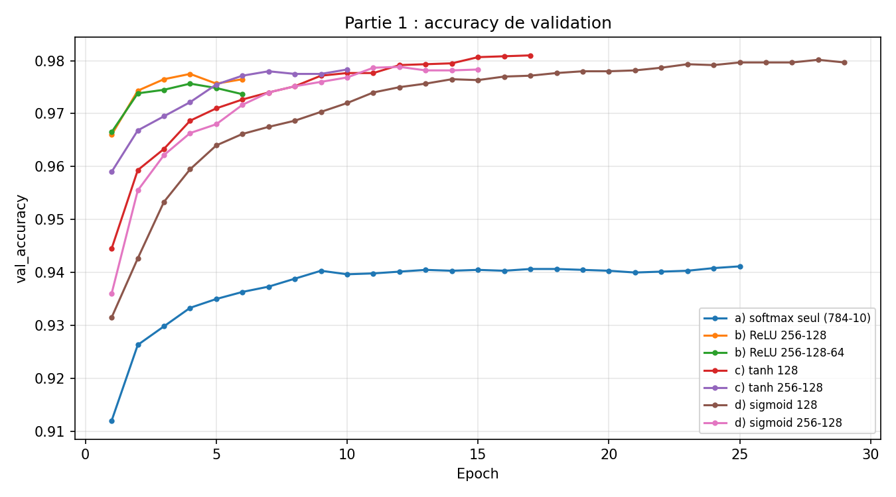
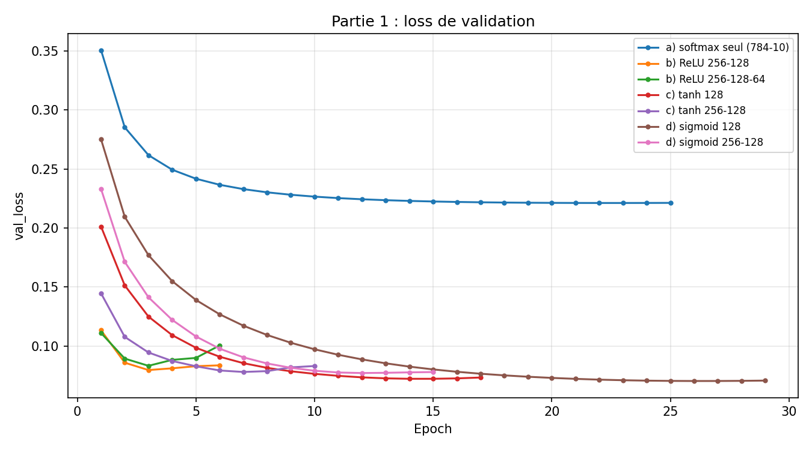
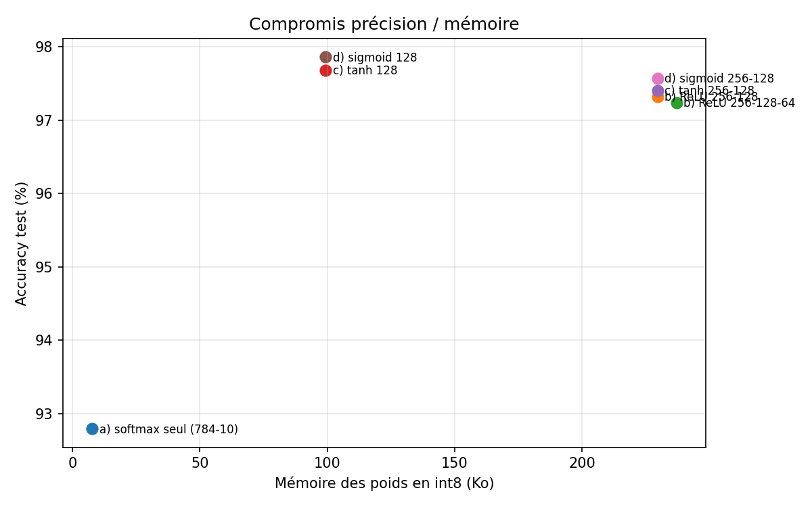

# TP1 : Classification MNIST avec un perceptron multicouche (MLP)

**Objectif :** classer des chiffres manuscrits (images 28×28 aplaties en 784 entrées, 10 classes) et étudier les
compromis entre **accuracy**, **nombre d'epochs** et **nombre de synapses** (taille de W en mémoire), en vue d'un
déploiement sur microcontrôleur STM32.

**Protocole :** 54 000 images d'entraînement, 6 000 de validation, 10 000 de test. Optimiseur Adam,
categorical_crossentropy, batch de 128, 30 epochs maximum avec arrêt anticipé
(EarlyStopping, patience 3 sur la loss de validation, meilleurs poids restaurés).
Mémoire estimée : paramètres × 4 octets (float32) ou × 1 octet (int8).

## Partie 1 : choix de la fonction d'activation

| config                   |   accuracy_test |   epoch_convergence |   epochs_executees |   parametres |   memoire_float32_Ko |   memoire_int8_Ko |   temps_entrainement_s |
|:-------------------------|----------------:|--------------------:|-------------------:|-------------:|---------------------:|------------------:|-----------------------:|
| a) softmax seul (784-10) |          0.9279 |                  22 |                 25 |         7850 |                 30.7 |               7.7 |                   33.6 |
| b) ReLU 256-128          |          0.9732 |                   3 |                  6 |       235146 |                918.5 |             229.6 |                   10.9 |
| b) ReLU 256-128-64       |          0.9724 |                   3 |                  6 |       242762 |                948.3 |             237.1 |                   13.7 |
| c) tanh 128              |          0.9768 |                  14 |                 17 |       101770 |                397.5 |              99.4 |                   24.2 |
| c) tanh 256-128          |          0.974  |                   7 |                 10 |       235146 |                918.5 |             229.6 |                   15.5 |
| d) sigmoid 128           |          0.9786 |                  26 |                 29 |       101770 |                397.5 |              99.4 |                   38.9 |
| d) sigmoid 256-128       |          0.9757 |                  12 |                 15 |       235146 |                918.5 |             229.6 |                   21.1 |

### Analyse (question 1.e)

- **Modèle linéaire :** le softmax seul (7850 paramètres, 7.7 Ko en int8)
  atteint 92.8 %. C'est la référence la plus légère.
- **Apport de la non-linéarité :** ajouter des couches cachées fait gagner jusqu'à **+5.1 points**.
- **Rendements décroissants :** le plus gros modèle ne gagne que -0.62 point(s) sur le plus petit
  modèle à couche cachée, pour **2.4× plus de mémoire**.
- **Activation et vitesse :** la convergence la plus rapide est obtenue par b) ReLU 256-128
  (3 epochs), la plus lente par d) sigmoid 128 (26 epochs).
  ReLU apprend vite mais surapprend rapidement (la loss de validation remonte après quelques epochs) ;
  sigmoid apprend plus lentement. Les écarts d'accuracy entre modèles à couches cachées
  (0.62 point(s) au maximum) sont du même ordre que la variabilité d'un entraînement à l'autre.
- **Contrainte embarquée :** en float32, les modèles de plus de 128 k paramètres dépassent les 512 Ko de Flash
  d'une STM32F446 ; après quantification int8, tous tiennent. Sur microcontrôleur, ReLU est la moins coûteuse
  à calculer (max(0, x), sans exponentielle), contrairement à tanh et sigmoid.

**Conclusion :** le meilleur compromis pour l'embarqué n'est pas le modèle le plus précis mais **une seule couche
cachée de 128 neurones** : précision quasi identique aux gros modèles, environ 100 Ko en int8.

## Fichiers
- `resultats/partie1_activations.csv` : résultats bruts
- `resultats/*.png` : courbes
- `TP1_MNIST.ipynb` : notebook complet
